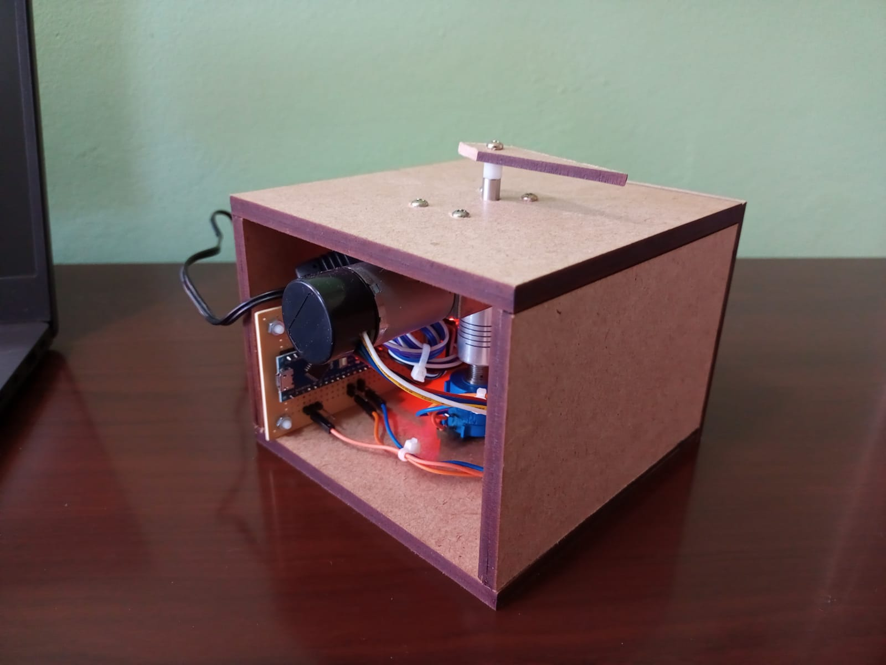
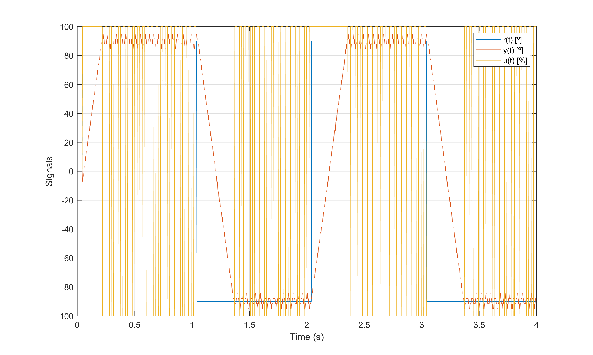
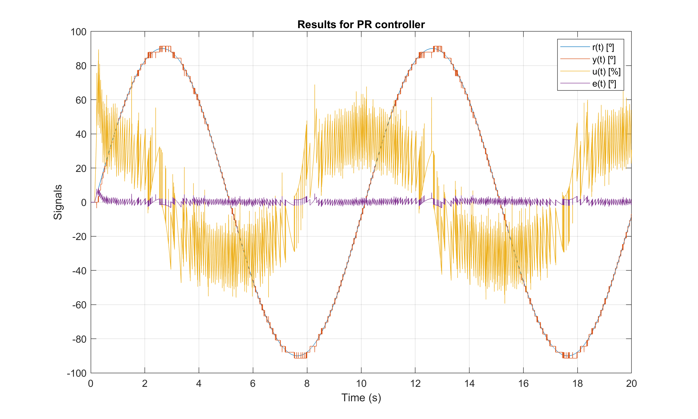
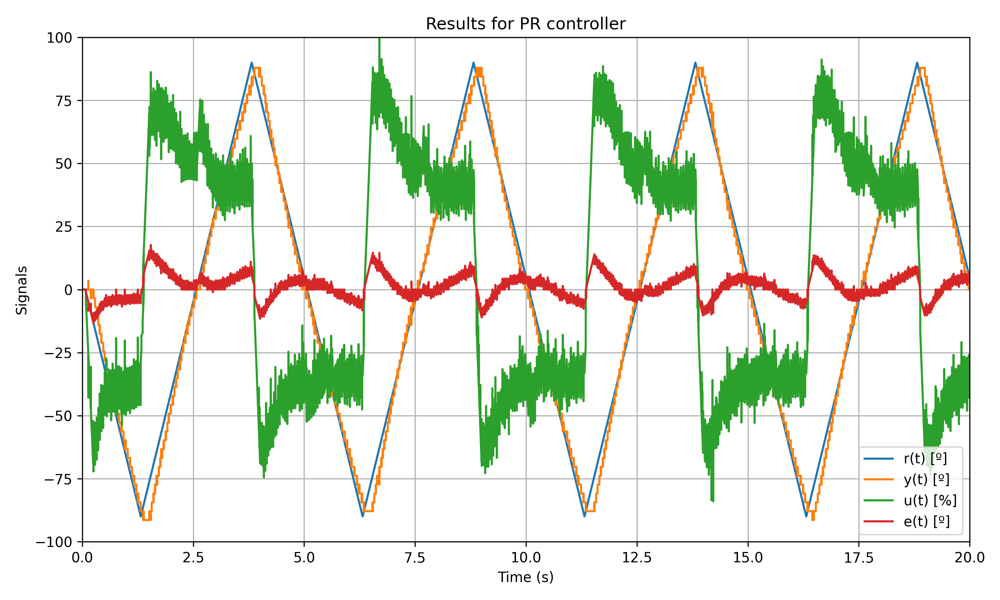

# DC motor position control

A control system project for regulating the angular position of a direct current (DC) motor using different controllers.

Initially, the practical aspects of constructing the physical experiment are presented. In sequence digital proportional-integral-derivative (PID), proportional-resonant (PR), and repetitive controllers are implemented. The data is acquired via a serial communication protocol and results can be plotted witth Python or Matlab scripts.

The following programs are available:
- [Relay method](./dc_motor_relay_method)
- [PID controller](./dc_motor_position_control_pid)
- [PR controller](./dc_motor_position_control_pr)
- [PMR controller](./dc_motor_position_control_pmr)
- [Repetitive controller](./dc_motor_position_control_repetitive)

## Physical experiment

The physical experiment is presented bellow

    

## Experimental results

Let $r(t)$ be the reference of angular position, $y(t)$ the angular position, $u(t)$ the control signal, and $e(t)$ the tracking error. First, a relay experiment should be performed in order to obtain the critical gain $K_{u}$ and critical period $P_u$ needed to tune (some of) the controllers:

    

Assuming a problem of sinusoidal reference tracking with a 90 degrees amplitude and frequency of 0.1 Hz, for a tuned PID controller the following response is obtained:

    

Cosidering a PR controller the following response is obtained:

    

Cosidering a repetitive controller the following response is obtained:

    

Assuming a problem of triangular reference tracking with a 90 degrees amplitude and frequency of 0.1 Hz, for a PR controller the following response is obtained:

    

Cosidering a PMR controller with $h = 6$ resonant modes the following response is obtained:

    

